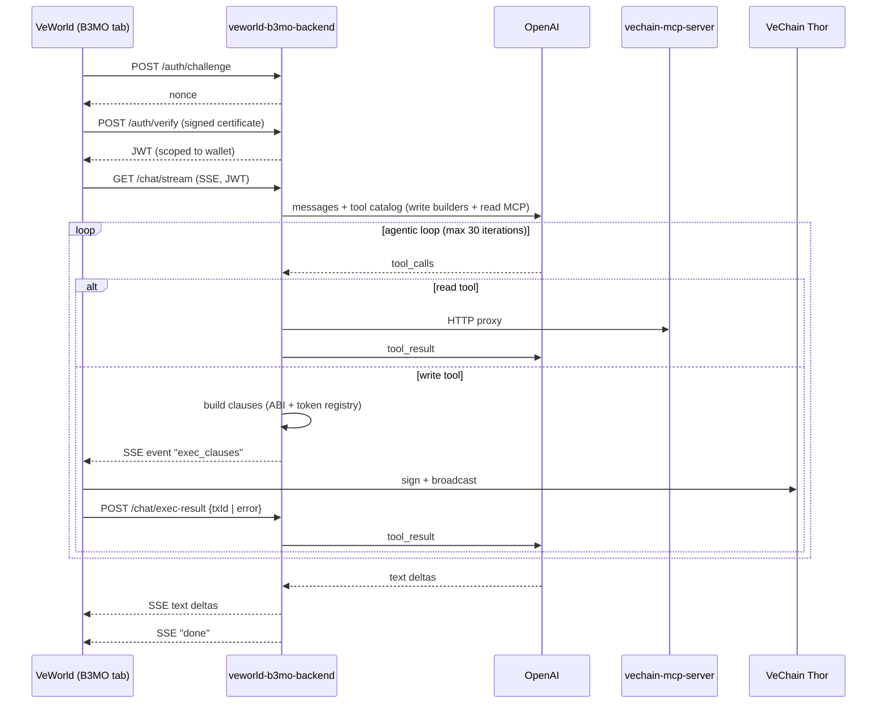

# B3MO Skill

B3MO is an AI agent tab inside **VeWorld Mobile** that controls one user-selected
mnemonic wallet to execute on-chain actions on VeChain (mainnet / testnet)
**autonomously, without per-tx user approval**. It is composed of:

- A new tab in the mobile app at `~/vechain/veworld-mobile`
- A dedicated backend at `~/vechain/veworld-b3mo-backend`
- A built-in proxy to the existing `~/vechain/vechain-mcp-server`

> **CRITICAL**: B3MO signs and broadcasts transactions silently. The mobile UX
> shows a permanent banner ("B3MO is operating autonomously") and an explicit
> onboarding disclaimer. Do not weaken these guards.

## High-level architecture



## Key design decisions (locked)

| Branch | Decision |
| --- | --- |
| Trust model | Zero hard caps. One-time biometric unlock at onboarding caches the wallet key for the session. Permanent banner + onboarding checkbox. |
| Wallet count | 1 linked wallet, switchable from Settings (resets chat). |
| Wallet types | Only `LOCAL_MNEMONIC`. Smart Wallet / Ledger / Watched are rejected. |
| Clause building | **Backend** translates ChatGPT intent (high-level tool calls) into VeChain clauses. App is a thin executor. |
| Swap | VeChain Swap (UniswapV2-fork router) addresses in `services/contracts.ts`. Routes through WVET when needed. |
| Read tools | Dynamic proxy of `vechain-mcp-server`'s `tools/list` — backend calls it on startup and exposes the catalog to OpenAI. |
| Networks | `mainnet` / `testnet`. ChatGPT can target either per tool call (`network` param). Solo is **out of scope** for MVP. |
| Auth | Sign-In-With-VeChain (SIWV) — backend issues nonce, app signs a Connex `Certificate`, backend issues 7d JWT scoped to `walletAddress`. |
| Sessions | Server-side store (memory in dev, Redis in prod via `SESSION_STORE` env). Title = first user message. |
| Streaming | Server-Sent Events. App uses XHR-based SSE polyfill in `src/Hooks/useB3mo/sseClient.ts`. |
| Failure handling | Tx failures are reported back to OpenAI → loop continues, AI reasons (gas / allowance / balance / slippage). |
| Iterations | Soft cap **30** per user turn (env `MAX_AGENTIC_ITERATIONS`). Backend emits `error` event on overflow. |
| Tool rendering | Collapsed cards in chat with status states: `pending` → `executing` → `success`/`failed` + tx hash + explorer link. |
| Tab placement | Between Apps and History. Hidden when selected account is observed. |
| Tab icon | `icon-bot` from the existing icon font (no new SVG needed). |
| i18n | All keys under `B3MO_AGENT_*`. 15 languages propagated via `/translate` flow. |
| Account badge | Tiny `icon-bot` next to alias on `AccountCard` if the address matches the linked wallet. |

## Repository layout

### Mobile (`~/vechain/veworld-mobile`)

| Path | Role |
| --- | --- |
| `src/Constants/Constants/B3mo.ts` | Backend URL + cert domain/purpose constants |
| `src/Storage/Redux/Slices/B3mo.ts` | Persisted slice: `linkedAddress`, `onboardingAcceptedAt` |
| `src/Storage/Redux/Slices/B3moSession.ts` | Non-persisted slice: `password` (walletKey), `jwt`, `currentSessionId` |
| `src/Storage/Redux/Selectors/B3mo.ts` | All B3MO selectors |
| `src/Storage/Redux/Migrations/Migration38.ts` | Adds `b3mo` slice |
| `src/Hooks/useB3mo/sseClient.ts` | XHR-based SSE polyfill |
| `src/Hooks/useB3mo/useB3moAuth.ts` | SIWV — sign challenge, get JWT |
| `src/Hooks/useB3mo/useB3moClient.ts` | Chat orchestration, SSE event reduction |
| `src/Hooks/useB3mo/useB3moExecutor.ts` | Sign + broadcast clauses received from backend |
| `src/Hooks/useB3mo/useB3moUnlock.ts` | Biometric unlock → cache walletKey in memory |
| `src/Hooks/useB3mo/walletAccess.ts` | Decrypt wallet using cached walletKey, derive private key |
| `src/Navigation/Stacks/B3moStack.tsx` | Stack with onboarding gating |
| `src/Navigation/Tabs/TabStack.tsx` | Tab insertion (between Apps & History) |
| `src/Screens/Flows/App/B3moScreen/Onboarding/*` | Intro / WalletChoice / PickWallet / Unlock |
| `src/Screens/Flows/App/B3moScreen/B3moChatScreen.tsx` | Chat screen + banner + composer |
| `src/Screens/Flows/App/B3moScreen/B3moHistoryScreen.tsx` | Sessions list (GET /sessions) |
| `src/Screens/Flows/App/B3moScreen/B3moSettingsScreen.tsx` | Switch wallet / reset |
| `src/Screens/Flows/App/B3moScreen/Components/*` | `B3moBanner`, `B3moComposer`, `B3moMessageBubble`, `B3moToolCard` |
| `src/Components/Reusable/AccountCard/AccountCard.tsx` | Robot badge on linked account |
| `src/i18n/translations/<lang>.json` | 15 languages × `B3MO_AGENT_*` keys |

### Backend (`~/vechain/veworld-b3mo-backend`)

| Path | Role |
| --- | --- |
| `src/index.ts` | Express bootstrap: cors, rate limiter (60/min), routes |
| `src/config.ts` | Zod-validated env vars |
| `src/middleware/auth.ts` | Bearer JWT verifier (also accepts `?token=` for SSE) |
| `src/routes/auth.ts` | SIWV: `POST /auth/challenge`, `POST /auth/verify` |
| `src/routes/chat.ts` | `GET /chat/stream` (SSE), `POST /chat/exec-result` |
| `src/routes/sessions.ts` | `GET /sessions`, `GET /sessions/:id`, `DELETE /sessions/:id` |
| `src/services/sessionStore.{ts,memory.ts,redis.ts}` | Adapter pattern |
| `src/services/openaiClient.ts` | Agentic loop with `MAX_AGENTIC_ITERATIONS` soft cap. Routes tool calls to write builder / local read handler / MCP proxy. |
| `src/services/localReadTools.ts` | Backend-implemented read tools (e.g. `stargate_get_validators`) curated on top of MCP. |
| `src/services/sse.ts` | SSE writer |
| `src/services/execGate.ts` | Promise gate to await app's tx result during a tool call |
| `src/services/mcpProxy.ts` | JSON-RPC proxy to `vechain-mcp-server` |
| `src/services/tokenRegistry.ts` | Per-network symbol→address map |
| `src/services/contracts.ts` | Stargate / VeChain Swap router / WVET addresses, `STARGATE_LEVELS` registry (id ↔ tier ↔ vet ↔ multiplier) |
| `src/services/thorClient.ts` | `thorView(network, to, data)` helper for `POST /accounts/*` view calls |
| `src/services/abiEncoder.ts` | viem `encodeFunctionData` for ERC20, Stargate, UniswapV2Router |
| `src/services/units.ts` | `parseUnits`, `applySlippage`, `toHex` |
| `src/services/clauseBuilder/sendToken.ts` | VET native + ERC20 transfer |
| `src/services/clauseBuilder/swap.ts` | swapExactETHForTokens / swapExactTokensForETH / swapExactTokensForTokens (with auto-WVET routing & approval clause) |
| `src/services/clauseBuilder/stargateDelegate.ts` | `delegate(tokenId, validator)` + `stakeAndDelegate` |
| `src/services/clauseBuilder/stargateUndelegate.ts` | `requestDelegationExit(tokenId)` |
| `src/services/clauseBuilder/stargateClaim.ts` | `claimRewards(tokenId)` (multi-token batch) |
| `src/tools/index.ts` | OpenAI tool catalog (write tools + dynamically loaded MCP read tools) |
| `Dockerfile` + `docker-compose.yml` | Prod-ready containers (web + redis) |

## Tool catalog

### Write tools (return clauses, app signs+broadcasts)

| Tool | Args | Notes |
| --- | --- | --- |
| `send_token` | `network`, `tokenSymbolOrAddress`, `amount`, `to` | VET native or ERC20 transfer. Resolves symbol via `tokenRegistry`. |
| `swap_tokens` | `network`, `fromToken`, `toToken`, `amountIn`, `slippageBps?`, `deadlineSeconds?` | UniswapV2-style routing through WVET. Adds approval clause when needed. Default slippage 100 bps (1%). |
| `stargate_stake_and_delegate` | `network`, `tier?`, `levelId?`, `validator`, `amount` | One-shot stake + delegate. Resolves tier from `tier` (preferred) or `levelId` or auto-from-`amount`. Validates `amount` matches the tier's exact required VET. Phase 2: emits a VTHO `approve(StargateNFT, boostAmount)` clause before the stake clause (boost fee fetched live via `boostAmountOfLevel`). On-chain level IDs are NOT sorted by size: 1=Strength(1M), 2=Thunder(5M), 3=Mjolnir(15M), 4-7=X tiers (legacy migration only), 8=Dawn(10K), 9=Lightning(50K), 10=Flash(200K). |
| `stargate_delegate` | `network`, `tokenId`, `validator` | Delegate existing NFT. |
| `stargate_undelegate` | `network`, `tokenId` | Calls `requestDelegationExit` on Stargate. |
| `stargate_claim_rewards` | `network`, `tokenIds[]` | One clause per `tokenId`; broadcast as a multi-clause tx. |

### Local read tools (backend-curated)

| Tool | Args | Notes |
| --- | --- | --- |
| `stargate_get_validators` | `network`, `tier?` / `levelId?` / `amount?`, `limit?`, `includeQueued?`, `maxOfflinePercent?` | Wraps MCP `getValidators` and returns a curated list `[{ validator, projectedApyPercent, currentApyPercent, percentageOffline, blockProbability, delegatorTvlUsd, totalTvlUsd, status }]` sorted by projected next-cycle APY for the chosen tier. Defaults: tier=Dawn, limit=5, ACTIVE only, drops offline%>30. Source of truth so the LLM can pick the best validator before `stargate_stake_and_delegate`. |

### Read tools (proxy)

Dynamically loaded from `vechain-mcp-server` at startup via JSON-RPC `tools/list`.
Currently surfaces ~65 tools: balances, transfers, B3TR/Stargate/VeVote
analytics, IPFS, search-docs, etc. Tools whose name collides with a local read
tool are masked. The OpenAI catalog is rebuilt automatically when MCP exposes
new tools.

## SSE event shapes

Sent from `/chat/stream` to the mobile app:

```ts
| { type: "session"; sessionId: string; title?: string }
| { type: "text_delta"; content: string }
| { type: "tool_call_start"; toolCallId: string; toolName: string; args: unknown }
| { type: "tool_call_result"; toolCallId: string; result: unknown }                 // read tools
| { type: "exec_clauses"; toolCallId: string; toolName: string; network: "mainnet" | "testnet"; clauses: Clause[]; gasHint?: number; summary?: string }
| { type: "error"; message: string; code?: string }
| { type: "done" }
```

App must respond to `exec_clauses` by calling `useB3moExecutor.execute(...)`,
which signs + broadcasts and POSTs `/chat/exec-result`.

## Onboarding flow

```
Routes.B3MO_ONBOARDING_INTRO       (disclaimer + checkbox)
        ↓
Routes.B3MO_ONBOARDING_WALLET_CHOICE  ("Create new" | "Use existing")
        ↓                              ↓
Routes.CREATE_WALLET_FLOW           Routes.B3MO_ONBOARDING_PICK_WALLET
                                       ↓
Routes.B3MO_ONBOARDING_UNLOCK         (biometric + SIWV)
        ↓
Routes.B3MO_CHAT
```

`B3moStack.tsx` selects the initial route from `selectIsB3moOnboarded` +
`selectIsB3moSessionUnlocked`.

The unlock screen calls `unlock(pin)` (returns the freshly-decrypted
`walletKey`) and immediately passes it to `signIn(walletKey)` to avoid a
stale-selector closure that would otherwise reject the first SIWV attempt.

## Security & safety

- The OpenAI key is **server-side only**. Never bundled in mobile code.
- The cached walletKey lives only in `B3moSessionSlice`, blacklisted from
  `redux-persist` (memory only). Cleared on app reset / `clearB3moLink`.
- Backend redacts addresses in logs (`0xabcd…1234`).
- Express rate-limits at 60 req/min per IP.
- `MAX_AGENTIC_ITERATIONS` soft-caps the loop and emits an `error` event with
  `code: "max_iterations"` on overflow.
- Onboarding requires the explicit `B3MO_AGENT_INTRO_DISCLAIMER` checkbox before
  the user can proceed.

## Common tasks

### Add a new write tool

1. Add a Zod schema and description in `src/tools/index.ts` (`writeToolSchemas` +
   `writeToolDescriptions`).
2. Implement `services/clauseBuilder/<newTool>.ts` returning `{ clauses, summary, gasHint }`.
3. Wire it in `services/clauseBuilder/index.ts` (`buildClausesForTool` switch + `WRITE_TOOLS` set).
4. Update this skill (`Tool catalog`).
5. Optionally add a Vitest test under the same folder.

### Add a new network

1. Add the entry in `tokenRegistry.ts` and `contracts.ts`.
2. Update `NetworkSchema` in `src/types.ts`.
3. Update mobile `pickNetwork` in `useB3moExecutor.ts` if mapping is non-trivial.

### Update i18n

Run `/translate` after editing keys. Source of truth is `en.json`. Keys must be
sorted case-insensitively.

## When to update this skill

Update this file when **any** of the below changes:

- A new tool is added or the schema of an existing tool changes.
- The SSE event shapes change.
- The onboarding flow gains/loses a step.
- The trust model changes (caps introduced, biometric removed, etc.).
- A new network is added.
- Backend endpoints are added/renamed.
- Redux slice shape changes.

The companion rule (`.cursor/rules/b3mo.mdc`) keeps `alwaysApply: true` so this
skill is automatically considered whenever B3MO files are in scope.
