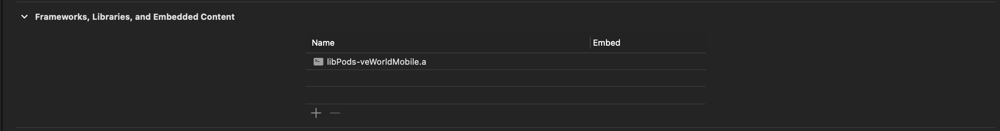
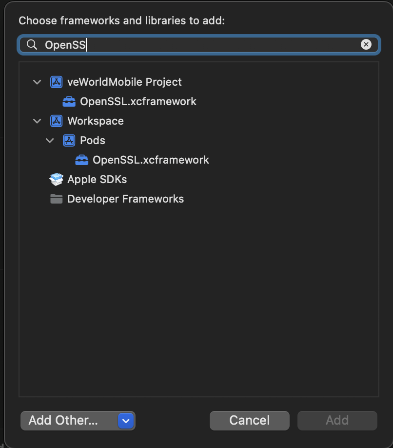
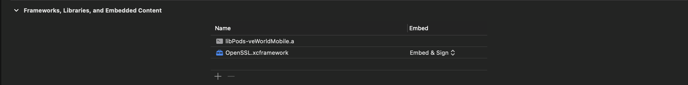

# veworld-mobile

# Environment setup

I order to run this project install the following dependencies:

**Global Dependencies**

```
- Homebrew
- Node - v18.12.1
- Ruby - v2.7.5
```

**Platform specific**

iOS:

Download Xcode form the Mac AppStore

```
- Xcode - v14.2
```

**Android**

```
- JDK - zulu11
- Android Studio
```

# Run the project

The first time you clone the repo you need to do:

```js
- yarn install
- npx pod-install
```

then on every other time:

### iOS

```js
- yarn start
- yarn ios
```

### Android

```js
- yarn start
- yarn android
```

Follow the official React Native [documentation](https://reactnative.dev/docs/environment-setup) for detailed explenation and additional steps.

#

# Git Conventions

### Convential commits

Read more [here](./docs/conventioanl_commits.md)

# Testing

This project uses [Detox](https://wix.github.io/Detox/docs/introduction/getting-started/) for E2E tests. Read more [here](./docs/detox.md)

# Translation

-   To add new translation strings just add them to `src/i18n/en/index.ts` or any other language that you need i.e. `src/i18n/it/index.ts`.

-   To add a new language add a new directory in `src/i18n` and name the folder with the desired language code i.e. `src/i18n/es` for spanish.

# Archive the Project

There is a workaround that needs to be done in order to archive a project.

-   Go to the target's `General` tab

-   On `Frameworks, Libraries and Embeded Content` click on the `+` icon to add a Framework
    

-   Look for `OpenSSL.xcFramework` and add it.
    
    

-   Remove it after archiving the project (Debug will not build with the framework embeded).
