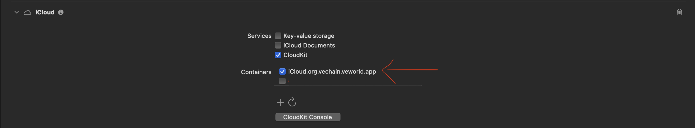

🌐 Official website: [Website](https://vechain.org/)<br/>
🏠 VeWorld website: [Website](https://veworld.net/)<br/>
📚 VeChain [Documentation](https://docs.vechain.org/)<br/>
❓ Have questions? Reach out to one of our community channels below!

<p align="center" style="padding: 0 0 30px;">
    <a href="https://discord.gg/vechain"></a>
    <a href="https://t.me/vechainandfriends"></a>
    <a href="https://www.reddit.com/r/Vechain"></a>
</p>

#

<div align="center">
    <h1>VeWorld - Vechain's Mobile Crypro Wallet</h1>
    <p>
        <a href="https://sonarcloud.io/summary/new_code?id=vechain_veworld-mobile">
        </a>
        <a href="https://sonarcloud.io/project/overview?id=vechain_veworld-mobile">
        </a>
        <a href="https://sonarcloud.io/project/overview?id=vechain_veworld-mobile">
        </a>
        <a href="https://github.com/vechain/vechain-veworld-mobile/blob/main/LICENSE"></a>
    </p>
</div>

VeWorld is an open-source crypto wallet for interacting with the Vechain blockchain. It supports viewing token balances and NFTs, executing transactions, connecting Ledger hardware wallets, and interacting with the VeBetterDAO ecosystem and other VeChain dApps

# iOS

### How to run the project

This project is using soe external services that are not neccesary during development, but in this moment some configuration files are needed in order to make it run. In order to generate these files do the following.

##

From the project root open your terminal and type the following:

```bash
cd ios

echo -e "defaults.url=https://sentry.io/\ndefaults.org=vechain-foundation\ndefaults.project=veworld-mobile" > sentry.properties
```

Then in Xcode add your account and a new `Bundle Id` for the project


Then on the `Signing and capabilities` tab scroll down on the iCloud capability and a new container using the same `Bundle Id` that you used earlier.



> **Note:** _You will see the following error on the logs when running the app:_
>
> Error: _Couldn't get container configuration from the server for container_
>
> _This error is related to the cloudKit container, if you need to use cloudkit you will have to setup the reccords manually through the developer portal clicking at the "Cloudkit Console" button._

Then type the following on your terminal:

`yarn install:all`

`yarn start`

Then open a new instance of the terminal on the project root and type:

`yarn ios`

# Android

### How Run the project

This project is using soe external services that are not neccesary during development, but in this moment some configuration files are needed in order to make it run. In order to generate these files do the following.

##

From the project root open your terminal and type the following:

```bash
cd android

echo -e "storePassword=mockvalue\nkeyPassword=mockvalue\nkeyAlias=mockvalue\nstoreFile=./release.keystore" > keystore.properties

keytool -genkeypair -v -keystore release.keystore -alias mockvalue -keyalg RSA -keysize 2048 -validity 10000 -storepass mockvalue -keypass mockvalue -dname "CN=Mock, OU=Mock, O=Mock, L=Mock, ST=Mock, C=US"
```

Then type the following on your terminal:

`yarn install:all`

`yarn start`

Then open a new instance of the terminal on the project root and type:

`yarn android:emus`

to select an android emulator to run the app (you need to have at least once active emulator on your android studio).

# How to contribute

## Merge Request Accpetance Criteria

In order to submitng a merge request please do the following:

1. `fork` the repo,
2. create a branch from `main` using the following convention for naming it.
3. Before opening a merge request create an issue if there isn't one already opened.

### Branch naming

Name your branch using the following convention:

### Feature

`feat-<branch name here>`

### Bug

`bug-<branch name here>`

Then open a merge request pointing to this repo's `main` branch. Please follow the merge request template when submitting.

### Commit Messages

This project uses conventional commits format for commit messages. Please use this when you submit a merge request.

Read more [here](./docs/conventional_commits.md)

### Testing

You are not required to write any tests, although new tests are always welocome :) but please make sure that current tests are passing on the CI phase and are not failing.

### Merge Request

Please add a video screen recording of the UI/UX flow or a screenshot of your device/simulator if the merge request contains changes in the UI/UX flow.

#

# Translations

### Generate the i18n language files

To generate the i18n files for every language,
create a `.env.local` file with the open ai key:

```
OPENAI_API_KEY=<your_openai_api_key>
```

and then run `yarn i18n:generate`

### Generate the i18n types

to only generate the i18n types run:

```bash
yarn i18n:types
```

# Testing

### Unit test

to run unit tests:

```bash
yarn test
```

to check unit test coverage:

```bash
yarn test:coverage
```

#

# E2E

This project uses Maestro for E2E tests. Read more [here](https://maestro.mobile.dev/)(https://maestro.mobile.dev/cli/cloud)
Simple setup. Maestro is a single binary that works anywhere.

Step 1: Install Maestro
To get started with Maestro, install it using the following command:
curl -Ls "https://get.maestro.mobile.dev" | bash

To upgrade the Maestro CLI:
curl -Ls "https://get.maestro.mobile.dev" | bash

Step 2: Prepare the Environment

On the `.env.local` file, paste this two lines and replace `<e2e_mnemonic>` with your mnemonic

```bash
# maestro test
IS_CI_BUILD_ENABLED="true"
E2E_MNEMONIC="<e2e_mnemonic>"
```

#### Android Emulator Setup

Step 1: Prepare the Environment

1. Navigate to your platform tools directory:
   cd `/Users/<username>/Library/Android/sdk/platform-tools`

2. Install adb

3. Open Android Studio

4. Start an emulator
   ./adb devices
   You should see an emulator listed.

Step 2: Generate and Install the APK

1. Generate the APK Locally:
   yarn purge
   yarn install:all
   yarn e2e.android.build.d

2. Start the Metro builder:
   yarn start:test

3. Install the APK on the emulator:
   ./adb -s emulator-5554 install ../veworld-mobile/android/app/build/outputs/apk/debug/app-debug.apk

Step 3: Execute Tests
Run the flow.yaml file to start the test:
maestro test .maestro (This command looks for the config file in the .maestro folder and picks the flows for execution.)

Uninstall the App (if needed):
./adb -s <emulator_id> uninstall org.vechain.veworld.app

#### iOS emulator Setup

Step 1: Prepare the Environment

1.  List iOS devices:
    xcrun simctl list (List of ios devices with device ids)

2.  Boot an iOS device:
    xcrun simctl boot <device_id>

Step 2: Generate and Install the App

1. Generate the iOS App Locally:
   yarn purge
   yarn install:all
   yarn e2e.ios.build.d

2. Start the Metro builder:
   yarn start:test

3. Install the App:
   xcrun simctl install <device_id> <ios_app_location>

Step 3: Execute Tests

1. Run tests:
   maestro test .maestro

2. Uninstall the App (if needed):
   xcrun simctl uninstall <device_id> org.vechain.veworld.app

For any issues or further assistance, please refer to the Maestro documentation(https://maestro.mobile.dev/)


# Deployments
The deployment process is automated for both Andorid and iOS.
Every evening release-overnight.yaml is ran to check if there was any new PRs merged into main in the past day if so then the release process is kicked off for both operating systems. The release artifacts are then uploaded to the relevant app stores ready for testing and further release to end users.
